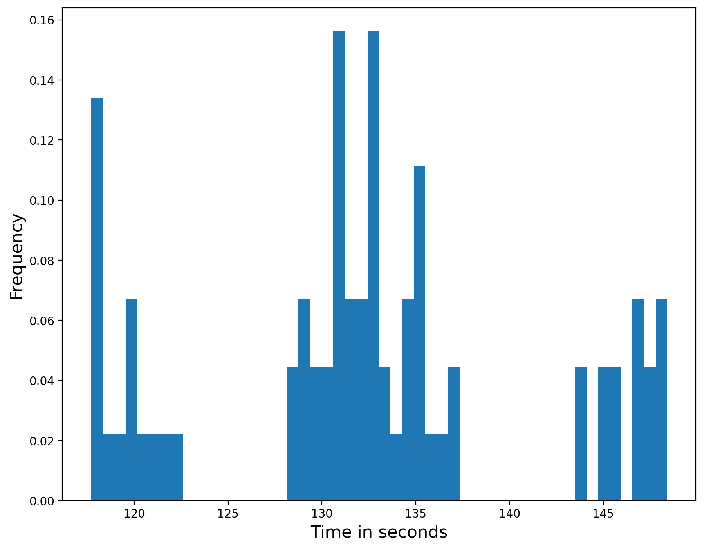
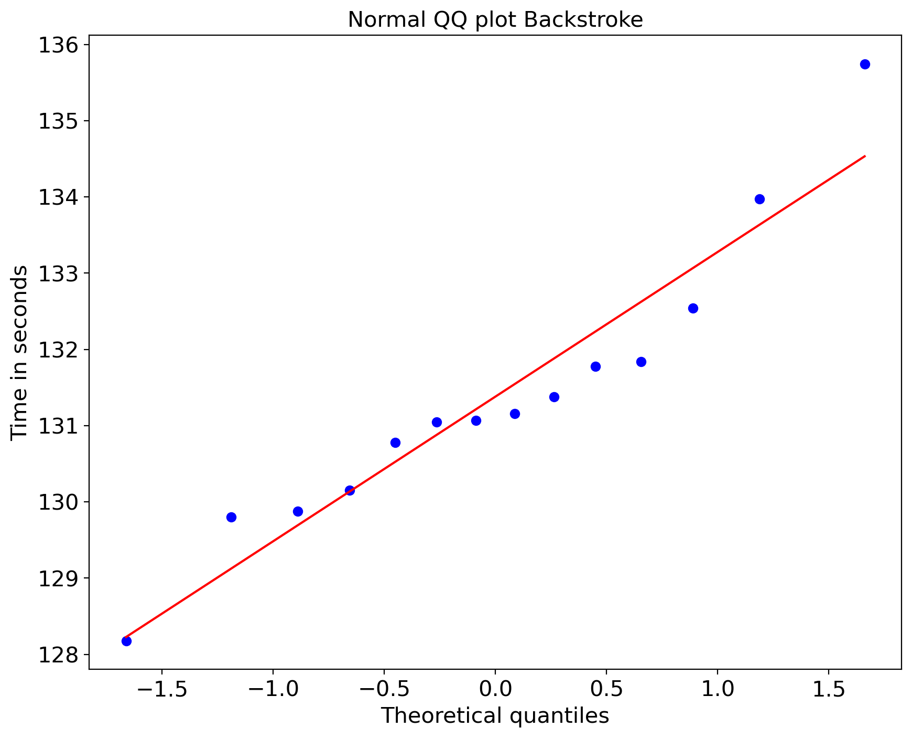
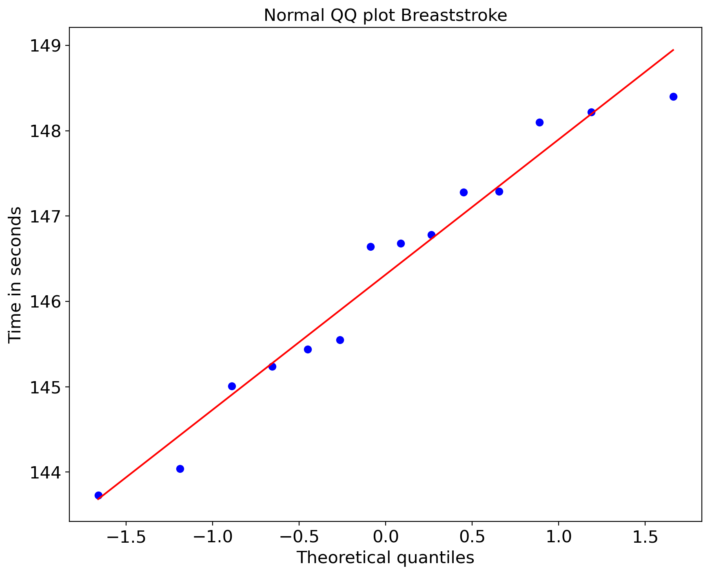
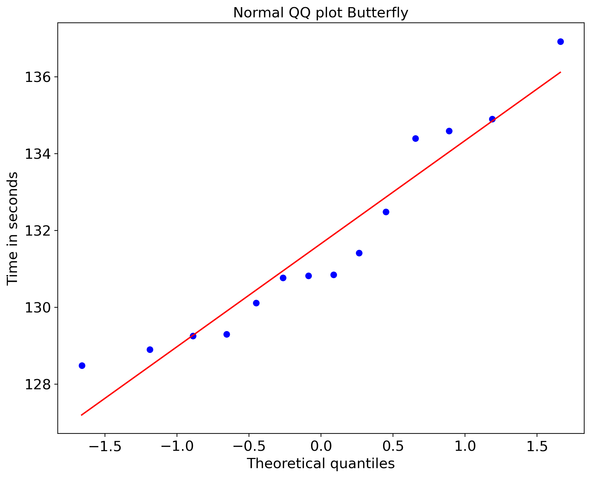
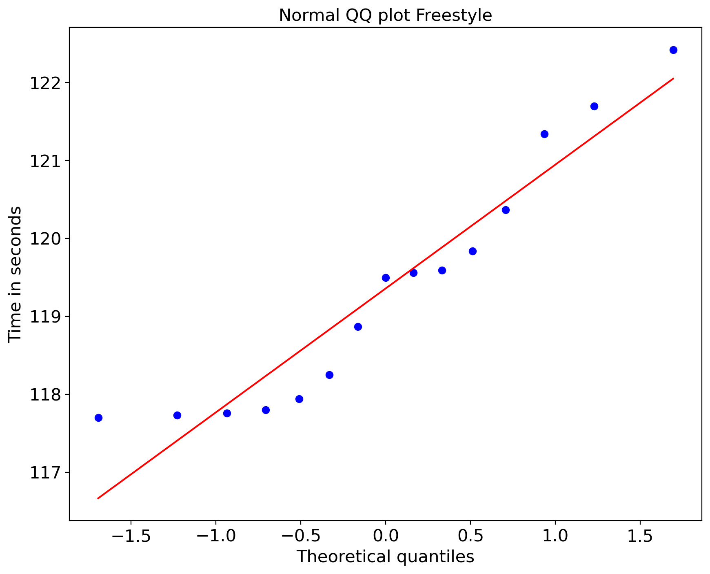
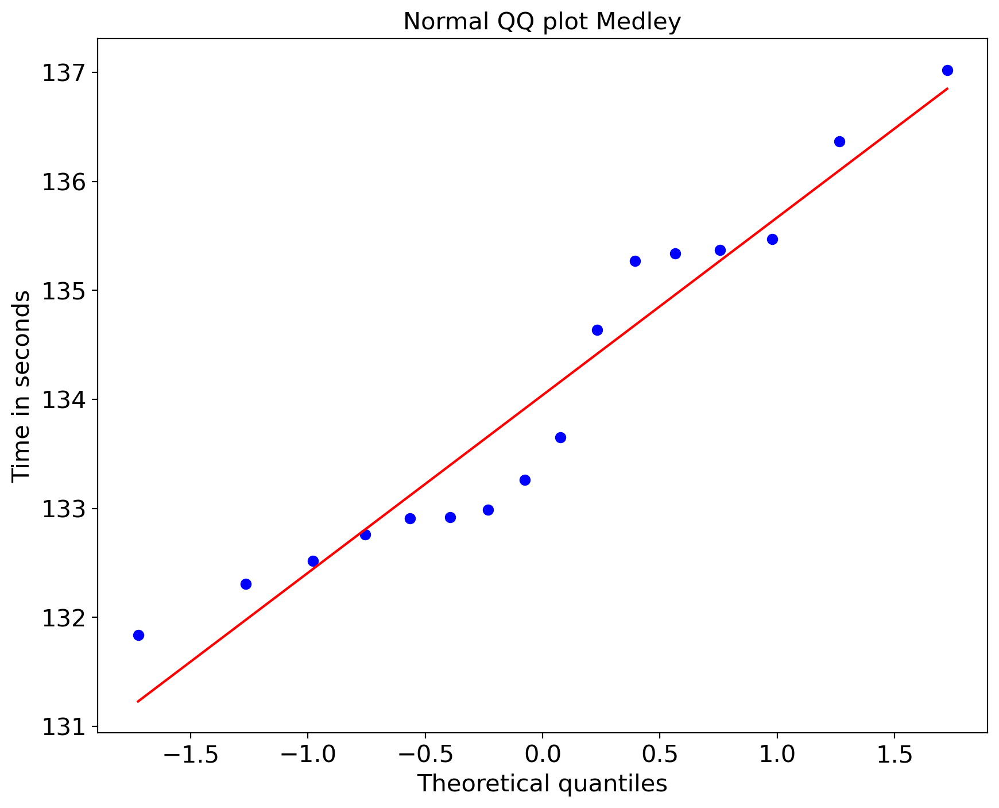

## Project - 2 
(Winter Semester 2022 - 2023)\
Comparison of multiple distributions\
Author - Raj Anilbhai Pawar\
Matriculation Number - 231811\
Group - 17\
Raj Anilbhai Pawar\
Amritha Sukhdev Singh Agarwal\
Sagar Basnet\
Muhammad Fahad\
Siddhartha Kark


```python
import pandas as pd

# used for the graphs
import seaborn as sns
import os

# used for testing
from scipy import stats
import statsmodels.api as sm
from statsmodels.formula.api import ols
from statsmodels.stats.weightstats import ttest_ind as ttest

# used for plotting
from matplotlib import pyplot as plt
import matplotlib
%matplotlib inline
```


```python
# Creating a directory for plots if it doesn't exist

if not os.path.isdir('Plots'):
    os.mkdir("Plots")
```


```python
# Read dataset
data = pd.read_csv("SwimmingTimes.csv")
```


```python
# Check duplicated
duplicate = data[data.duplicated('Name',keep = False)]
duplicate
```


<div>
<style scoped>
    .dataframe tbody tr th:only-of-type {
        vertical-align: middle;
    }

    .dataframe tbody tr th {
        vertical-align: top;
    }

    .dataframe thead th {
        text-align: right;
    }
</style>
<table border="1" class="dataframe">
  <thead>
    <tr style="text-align: right;">
      <th></th>
      <th>Category</th>
      <th>Name</th>
      <th>Time</th>
    </tr>
  </thead>
  <tbody>
    <tr>
      <th>1</th>
      <td>Backstroke</td>
      <td>AnastasyaGorbenko</td>
      <td>131.46</td>
    </tr>
    <tr>
      <th>4</th>
      <td>Backstroke</td>
      <td>KatieShanahan</td>
      <td>129.82</td>
    </tr>
    <tr>
      <th>18</th>
      <td>Breaststroke</td>
      <td>KristynaHorska</td>
      <td>145.55</td>
    </tr>
    <tr>
      <th>23</th>
      <td>Breaststroke</td>
      <td>LauraLahtinen</td>
      <td>147.60</td>
    </tr>
    <tr>
      <th>32</th>
      <td>Butterfly</td>
      <td>MireiaBelmonteGarcia</td>
      <td>134.01</td>
    </tr>
    <tr>
      <th>33</th>
      <td>Butterfly</td>
      <td>KatinkaHosszu</td>
      <td>134.54</td>
    </tr>
    <tr>
      <th>41</th>
      <td>Butterfly</td>
      <td>LauraLahtinen</td>
      <td>131.41</td>
    </tr>
    <tr>
      <th>50</th>
      <td>Freestyle</td>
      <td>MarritSteenbergen</td>
      <td>117.40</td>
    </tr>
    <tr>
      <th>66</th>
      <td>Medley</td>
      <td>KatieShanahan</td>
      <td>131.84</td>
    </tr>
    <tr>
      <th>68</th>
      <td>Medley</td>
      <td>KristynaHorska</td>
      <td>132.99</td>
    </tr>
    <tr>
      <th>69</th>
      <td>Medley</td>
      <td>MarritSteenbergen</td>
      <td>132.31</td>
    </tr>
    <tr>
      <th>75</th>
      <td>Medley</td>
      <td>AnastasyaGorbenko</td>
      <td>132.91</td>
    </tr>
    <tr>
      <th>76</th>
      <td>Medley</td>
      <td>KatinkaHosszu</td>
      <td>132.52</td>
    </tr>
    <tr>
      <th>78</th>
      <td>Medley</td>
      <td>MireiaBelmonteGarcia</td>
      <td>135.47</td>
    </tr>
  </tbody>
</table>
</div>


```python
# Drop duplicated
data_unique = data.drop_duplicates(subset=['Name'],keep = 'last')
data_unique
```


<div>
<style scoped>
    .dataframe tbody tr th:only-of-type {
        vertical-align: middle;
    }

    .dataframe tbody tr th {
        vertical-align: top;
    }

    .dataframe thead th {
        text-align: right;
    }
</style>
<table border="1" class="dataframe">
  <thead>
    <tr style="text-align: right;">
      <th></th>
      <th>Category</th>
      <th>Name</th>
      <th>Time</th>
    </tr>
  </thead>
  <tbody>
    <tr>
      <th>0</th>
      <td>Backstroke</td>
      <td>SonneleOeztuerk</td>
      <td>133.97</td>
    </tr>
    <tr>
      <th>2</th>
      <td>Backstroke</td>
      <td>CamilaRodriguesRebelo</td>
      <td>131.05</td>
    </tr>
    <tr>
      <th>3</th>
      <td>Backstroke</td>
      <td>DoraMolnar</td>
      <td>129.88</td>
    </tr>
    <tr>
      <th>5</th>
      <td>Backstroke</td>
      <td>CarmenWeilerSastre</td>
      <td>131.78</td>
    </tr>
    <tr>
      <th>6</th>
      <td>Backstroke</td>
      <td>LenaGrabowski</td>
      <td>130.78</td>
    </tr>
    <tr>
      <th>...</th>
      <td>...</td>
      <td>...</td>
      <td>...</td>
    </tr>
    <tr>
      <th>75</th>
      <td>Medley</td>
      <td>AnastasyaGorbenko</td>
      <td>132.91</td>
    </tr>
    <tr>
      <th>76</th>
      <td>Medley</td>
      <td>KatinkaHosszu</td>
      <td>132.52</td>
    </tr>
    <tr>
      <th>77</th>
      <td>Medley</td>
      <td>LenaKreundl</td>
      <td>135.37</td>
    </tr>
    <tr>
      <th>78</th>
      <td>Medley</td>
      <td>MireiaBelmonteGarcia</td>
      <td>135.47</td>
    </tr>
    <tr>
      <th>79</th>
      <td>Medley</td>
      <td>FrancescaFresia</td>
      <td>136.37</td>
    </tr>
  </tbody>
</table>
<p>73 rows × 3 columns</p>
</div>


```python
# Checking nans
nan_rows = data_unique[data_unique.isnull().any(axis=1)]
print("NAN Rows: ", len(nan_rows))
```

    NAN Rows:  0
    


```python
# Plot histogram to check distribution
plt.figure(figsize=(10, 8), dpi=200)
freq_dist_fig = data_unique["Time"].plot(kind = "hist", density = True, bins=50)
plt.rc('xtick', labelsize=15)
plt.rc('ytick', labelsize=15)
plt.xlabel('Time in seconds', fontsize=15)
plt.ylabel('Frequency', fontsize=15)
plt.show()
freq_dist_fig.figure.savefig('Plots/Hist_Frequency_Distribution.pdf')
```


    

    


Description of the variables


```python
print("Data set size: ", len(data_unique))
data_unique.describe()
```

    Data set size:  73
    


<div>
<style scoped>
    .dataframe tbody tr th:only-of-type {
        vertical-align: middle;
    }

    .dataframe tbody tr th {
        vertical-align: top;
    }

    .dataframe thead th {
        text-align: right;
    }
</style>
<table border="1" class="dataframe">
  <thead>
    <tr style="text-align: right;">
      <th></th>
      <th>Time</th>
    </tr>
  </thead>
  <tbody>
    <tr>
      <th>count</th>
      <td>73.000000</td>
    </tr>
    <tr>
      <th>mean</th>
      <td>132.409863</td>
    </tr>
    <tr>
      <th>std</th>
      <td>8.789126</td>
    </tr>
    <tr>
      <th>min</th>
      <td>117.700000</td>
    </tr>
    <tr>
      <th>25%</th>
      <td>129.250000</td>
    </tr>
    <tr>
      <th>50%</th>
      <td>132.310000</td>
    </tr>
    <tr>
      <th>75%</th>
      <td>135.470000</td>
    </tr>
    <tr>
      <th>max</th>
      <td>148.400000</td>
    </tr>
  </tbody>
</table>
</div>


```python
# Check unique swimming categories in data
categories = data_unique["Category"].unique().tolist()
categories
```


    ['Backstroke', 'Breaststroke', 'Butterfly', 'Freestyle', 'Medley']


```python
# Grouping data by category
grouped_data = data_unique.groupby("Category")
category_list = list(grouped_data)
```


```python
# Check Inter Quartile Range (IQR)
x = grouped_data["Time"].describe()
x["IQR"] = x["75%"] - x["25%"]
x.round(2)
```


<div>
<style scoped>
    .dataframe tbody tr th:only-of-type {
        vertical-align: middle;
    }

    .dataframe tbody tr th {
        vertical-align: top;
    }

    .dataframe thead th {
        text-align: right;
    }
</style>
<table border="1" class="dataframe">
  <thead>
    <tr style="text-align: right;">
      <th></th>
      <th>count</th>
      <th>mean</th>
      <th>std</th>
      <th>min</th>
      <th>25%</th>
      <th>50%</th>
      <th>75%</th>
      <th>max</th>
      <th>IQR</th>
    </tr>
    <tr>
      <th>Category</th>
      <th></th>
      <th></th>
      <th></th>
      <th></th>
      <th></th>
      <th></th>
      <th></th>
      <th></th>
      <th></th>
    </tr>
  </thead>
  <tbody>
    <tr>
      <th>Backstroke</th>
      <td>14.0</td>
      <td>131.38</td>
      <td>1.85</td>
      <td>128.18</td>
      <td>130.31</td>
      <td>131.12</td>
      <td>131.82</td>
      <td>135.74</td>
      <td>1.52</td>
    </tr>
    <tr>
      <th>Breaststroke</th>
      <td>14.0</td>
      <td>146.31</td>
      <td>1.51</td>
      <td>143.73</td>
      <td>145.29</td>
      <td>146.66</td>
      <td>147.29</td>
      <td>148.40</td>
      <td>2.00</td>
    </tr>
    <tr>
      <th>Butterfly</th>
      <td>14.0</td>
      <td>131.66</td>
      <td>2.61</td>
      <td>128.48</td>
      <td>129.50</td>
      <td>130.83</td>
      <td>133.92</td>
      <td>136.92</td>
      <td>4.42</td>
    </tr>
    <tr>
      <th>Freestyle</th>
      <td>15.0</td>
      <td>119.36</td>
      <td>1.56</td>
      <td>117.70</td>
      <td>117.87</td>
      <td>119.50</td>
      <td>120.10</td>
      <td>122.42</td>
      <td>2.23</td>
    </tr>
    <tr>
      <th>Medley</th>
      <td>16.0</td>
      <td>134.04</td>
      <td>1.59</td>
      <td>131.84</td>
      <td>132.87</td>
      <td>133.45</td>
      <td>135.35</td>
      <td>137.02</td>
      <td>2.47</td>
    </tr>
  </tbody>
</table>
</div>


```python
# Separating data into different data frames according to swimming categories
df_backstroke = category_list[0][1]
df_breaststroke = category_list[1][1]
df_butterfly = category_list[2][1]
df_freestyle = category_list[3][1]
df_medley = category_list[4][1]

df_backstroke = df_backstroke.reset_index(drop=True)
df_breaststroke = df_breaststroke.reset_index(drop=True)
df_butterfly = df_butterfly.reset_index(drop=True)
df_freestyle = df_freestyle.reset_index(drop=True)
df_medley = df_medley.reset_index(drop=True)
```

Descriptive Analysis of variables


```python
# Generate box-plot for swimming categories based on time
plt.figure(figsize=(10, 8), dpi=200)
sns.boxplot(y="Category", x="Time", data=data_unique)
sns.stripplot(y="Category", x="Time", color='black',alpha=0.3,data=data_unique)
plt.rc('xtick', labelsize=15)
plt.rc('ytick', labelsize=15)
plt.xlabel('Time in seconds', fontsize=15)
plt.ylabel('Swimming Category', fontsize=15)
plt.show()
plt.savefig('Plots/Boxplot_Swimming_Categories.pdf')
```


    

    


    <Figure size 432x288 with 0 Axes>


```python
# Check individual swimming category variance
print("variance: %.2f" % df_backstroke['Time'].var())
print("variance: %.2f" % df_breaststroke['Time'].var())
print("variance: %.2f" % df_butterfly['Time'].var())
print("variance: %.2f" % df_freestyle['Time'].var())
print("variance: %.2f" % df_medley['Time'].var())
```

    variance: 3.43
    variance: 2.27
    variance: 6.82
    variance: 2.43
    variance: 2.52
    

QQ Plots - Used to test assumptions for annova

#### Backstroke


```python
plt.figure(figsize=(10, 8), dpi=200)
stats.probplot(df_backstroke["Time"], dist="norm", plot = plt)
plt.title("Normal QQ plot Backstroke", fontsize=15)
plt.rc('xtick', labelsize=15)
plt.rc('ytick', labelsize=15)
plt.xlabel('Theoretical quantiles', fontsize=15)
plt.ylabel('Time in seconds', fontsize=15)
plt.show()
plt.savefig("Plots/QQ_Backstroke.pdf")
```


    

    


    <Figure size 432x288 with 0 Axes>


#### Breaststroke


```python
plt.figure(figsize=(10, 8), dpi=200)
stats.probplot(df_breaststroke["Time"], dist="norm", plot = plt)
plt.title("Normal QQ plot Breaststroke", fontsize=15)
plt.rc('xtick', labelsize=15)
plt.rc('ytick', labelsize=15)
plt.xlabel('Theoretical quantiles', fontsize=15)
plt.ylabel('Time in seconds', fontsize=15)
plt.show()
plt.savefig("Plots/QQ_Breaststroke.pdf")
```


    

    


    <Figure size 432x288 with 0 Axes>


#### Butterfly


```python
plt.figure(figsize=(10, 8), dpi=200)
stats.probplot(df_butterfly["Time"], dist="norm", plot = plt)
plt.title("Normal QQ plot Butterfly", fontsize=15)
plt.rc('xtick', labelsize=15)
plt.rc('ytick', labelsize=15)
plt.xlabel('Theoretical quantiles', fontsize=15)
plt.ylabel('Time in seconds', fontsize=15)
plt.show()
plt.savefig("Plots/QQ_Butterfly.pdf")
```


    

    


    <Figure size 432x288 with 0 Axes>


#### Freestyle


```python
plt.figure(figsize=(10, 8), dpi=200)
stats.probplot(df_freestyle["Time"], dist="norm", plot = plt)
plt.title("Normal QQ plot Freestyle", fontsize=15)
plt.rc('xtick', labelsize=15)
plt.rc('ytick', labelsize=15)
plt.xlabel('Theoretical quantiles', fontsize=15)
plt.ylabel('Time in seconds', fontsize=15)
plt.show()
plt.savefig("Plots/QQ_Freestyle.pdf")
```


    

    


    <Figure size 432x288 with 0 Axes>


#### Medley


```python
plt.figure(figsize=(10, 8), dpi=200)
stats.probplot(df_medley["Time"], dist="norm", plot = plt)
plt.title("Normal QQ plot Medley", fontsize=15)
plt.rc('xtick', labelsize=15)
plt.rc('ytick', labelsize=15)
plt.xlabel('Theoretical quantiles', fontsize=15)
plt.ylabel('Time in seconds', fontsize=15)
plt.show()
plt.savefig("Plots/QQ_Medley.pdf")
```


    

    


    <Figure size 432x288 with 0 Axes>


Annova Test - Used to conduct a global test


```python
st_model = ols('Time ~ C(Category)', data=data_unique).fit()
result_anova = sm.stats.anova_lm(st_model, typ=2)
result_anova
```


<div>
<style scoped>
    .dataframe tbody tr th:only-of-type {
        vertical-align: middle;
    }

    .dataframe tbody tr th {
        vertical-align: top;
    }

    .dataframe thead th {
        text-align: right;
    }
</style>
<table border="1" class="dataframe">
  <thead>
    <tr style="text-align: right;">
      <th></th>
      <th>sum_sq</th>
      <th>df</th>
      <th>F</th>
      <th>PR(&gt;F)</th>
    </tr>
  </thead>
  <tbody>
    <tr>
      <th>C(Category)</th>
      <td>5327.241994</td>
      <td>4.0</td>
      <td>385.922627</td>
      <td>6.076029e-46</td>
    </tr>
    <tr>
      <th>Residual</th>
      <td>234.666504</td>
      <td>68.0</td>
      <td>NaN</td>
      <td>NaN</td>
    </tr>
  </tbody>
</table>
</div>


```python
# converting result to use in latex report
print(result_anova.round(2).to_latex())
```

    \begin{tabular}{lrrrr}
    \toprule
    {} &   sum\_sq &    df &       F &  PR(>F) \\
    \midrule
    C(Category) &  5327.24 &   4.0 &  385.92 &     0.0 \\
    Residual    &   234.67 &  68.0 &     NaN &     NaN \\
    \bottomrule
    \end{tabular}
    
    

Conducting Two Sample t-test


```python
from statsmodels.stats.multicomp import MultiComparison
from scipy.stats import ttest_ind
   
comp = MultiComparison(data_unique['Time'], data_unique['Category'])
tbl, a1, a2 = comp.allpairtest(ttest_ind,method="bonf",alpha = 0.05)
tbl
```


<table class="simpletable">
<caption>Test Multiple Comparison ttest_ind 
FWER=0.05 method=bonf
alphacSidak=0.01, alphacBonf=0.005</caption>
<tr>
     <th>group1</th>       <th>group2</th>      <th>stat</th>    <th>pval</th>  <th>pval_corr</th> <th>reject</th>
</tr>
<tr>
   <td>Backstroke</td>  <td>Breaststroke</td> <td>-23.4029</td>   <td>0.0</td>     <td>0.0</td>     <td>True</td> 
</tr>
<tr>
   <td>Backstroke</td>    <td>Butterfly</td>   <td>-0.3231</td> <td>0.7492</td>    <td>1.0</td>     <td>False</td>
</tr>
<tr>
   <td>Backstroke</td>    <td>Freestyle</td>   <td>18.9651</td>   <td>0.0</td>     <td>0.0</td>     <td>True</td> 
</tr>
<tr>
   <td>Backstroke</td>     <td>Medley</td>     <td>-4.2368</td> <td>0.0002</td>  <td>0.0022</td>    <td>True</td> 
</tr>
<tr>
  <td>Breaststroke</td>   <td>Butterfly</td>   <td>18.1855</td>   <td>0.0</td>     <td>0.0</td>     <td>True</td> 
</tr>
<tr>
  <td>Breaststroke</td>   <td>Freestyle</td>   <td>47.2693</td>   <td>0.0</td>     <td>0.0</td>     <td>True</td> 
</tr>
<tr>
  <td>Breaststroke</td>    <td>Medley</td>     <td>21.6131</td>   <td>0.0</td>     <td>0.0</td>     <td>True</td> 
</tr>
<tr>
    <td>Butterfly</td>    <td>Freestyle</td>   <td>15.5252</td>   <td>0.0</td>     <td>0.0</td>     <td>True</td> 
</tr>
<tr>
    <td>Butterfly</td>     <td>Medley</td>     <td>-3.0638</td> <td>0.0048</td>  <td>0.0479</td>    <td>True</td> 
</tr>
<tr>
    <td>Freestyle</td>     <td>Medley</td>    <td>-25.9482</td>   <td>0.0</td>     <td>0.0</td>     <td>True</td> 
</tr>
</table>


Bonferroni Correlation


```python
df = pd.DataFrame(tbl,columns=["group1","group2","stat","pval","pval_corr","reject_corr"])
df = df.iloc[1:]
df['reject'] = df['pval'].astype(str) <= str(0.05)
print("Multiple Comparison t-test Significance_value=0.05 FWER=0.26 method=bonf NEW_FWER=0.05, Adjusted_Significance_value=0.003")
df
```

    Multiple Comparison t-test Significance_value=0.05 FWER=0.26 method=bonf NEW_FWER=0.05, Adjusted_Significance_value=0.003
    


<div>
<style scoped>
    .dataframe tbody tr th:only-of-type {
        vertical-align: middle;
    }

    .dataframe tbody tr th {
        vertical-align: top;
    }

    .dataframe thead th {
        text-align: right;
    }
</style>
<table border="1" class="dataframe">
  <thead>
    <tr style="text-align: right;">
      <th></th>
      <th>group1</th>
      <th>group2</th>
      <th>stat</th>
      <th>pval</th>
      <th>pval_corr</th>
      <th>reject_corr</th>
      <th>reject</th>
    </tr>
  </thead>
  <tbody>
    <tr>
      <th>1</th>
      <td>Backstroke</td>
      <td>Breaststroke</td>
      <td>-23.4029</td>
      <td>0.0</td>
      <td>0.0</td>
      <td>True</td>
      <td>True</td>
    </tr>
    <tr>
      <th>2</th>
      <td>Backstroke</td>
      <td>Butterfly</td>
      <td>-0.3231</td>
      <td>0.7492</td>
      <td>1.0</td>
      <td>False</td>
      <td>False</td>
    </tr>
    <tr>
      <th>3</th>
      <td>Backstroke</td>
      <td>Freestyle</td>
      <td>18.9651</td>
      <td>0.0</td>
      <td>0.0</td>
      <td>True</td>
      <td>True</td>
    </tr>
    <tr>
      <th>4</th>
      <td>Backstroke</td>
      <td>Medley</td>
      <td>-4.2368</td>
      <td>0.0002</td>
      <td>0.0022</td>
      <td>True</td>
      <td>True</td>
    </tr>
    <tr>
      <th>5</th>
      <td>Breaststroke</td>
      <td>Butterfly</td>
      <td>18.1855</td>
      <td>0.0</td>
      <td>0.0</td>
      <td>True</td>
      <td>True</td>
    </tr>
    <tr>
      <th>6</th>
      <td>Breaststroke</td>
      <td>Freestyle</td>
      <td>47.2693</td>
      <td>0.0</td>
      <td>0.0</td>
      <td>True</td>
      <td>True</td>
    </tr>
    <tr>
      <th>7</th>
      <td>Breaststroke</td>
      <td>Medley</td>
      <td>21.6131</td>
      <td>0.0</td>
      <td>0.0</td>
      <td>True</td>
      <td>True</td>
    </tr>
    <tr>
      <th>8</th>
      <td>Butterfly</td>
      <td>Freestyle</td>
      <td>15.5252</td>
      <td>0.0</td>
      <td>0.0</td>
      <td>True</td>
      <td>True</td>
    </tr>
    <tr>
      <th>9</th>
      <td>Butterfly</td>
      <td>Medley</td>
      <td>-3.0638</td>
      <td>0.0048</td>
      <td>0.0479</td>
      <td>True</td>
      <td>True</td>
    </tr>
    <tr>
      <th>10</th>
      <td>Freestyle</td>
      <td>Medley</td>
      <td>-25.9482</td>
      <td>0.0</td>
      <td>0.0</td>
      <td>True</td>
      <td>True</td>
    </tr>
  </tbody>
</table>
</div>


#### Holm-Bonferroni Method 
###### The Holm-Bonferroni Method (also called Holm’s Sequential Bonferroni Procedure) is a way to deal with familywise error rates (FWER) for multiple hypothesis tests. It is a modification of the Bonferroni correction. The Bonferroni correction reduces the possibility of getting a statistically significant result (i.e. a Type I error) when performing multiple tests. Although the Bonferroni is simple to calculate, it suffers from a lack of statistical power. The Holm-Bonferroni method is also fairly simple to calculate, but it is more powerful than the single-step Bonferroni.


```python
#ToDo: correct the test results with the holm bonferonni correction method
# reference: https://www.statisticshowto.com/holm-bonferroni-method/
# reference Holm, S. 1979. A simple sequential rejective multiple test procedure. Scandinavian Journal of Statistics 6:65-70
```
