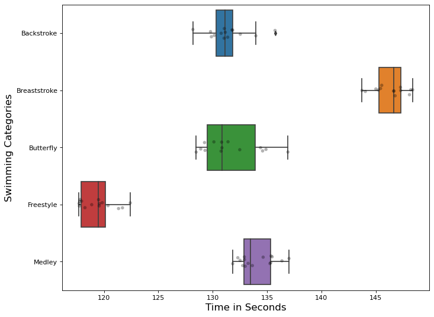

## Project - 2 
(Winter Semester 2022 - 2023)\
Comparison of multiple distributions


```python
import pandas as pd

# used for the graphs
import seaborn as sns
import os

# used for testing
from scipy import stats
import statsmodels.api as sm
from statsmodels.formula.api import ols
from statsmodels.stats.weightstats import ttest_ind as ttest
import numpy as np

# used for plotting
from matplotlib import pyplot as plt
import matplotlib
%matplotlib inline
```


```python
# Creating a directory for plots if it doesn't exist

if not os.path.isdir('Plots'):
    os.mkdir("Plots")
```


```python
# Read dataset
data = pd.read_csv("SwimmingTimes.csv")
```


```python
# Check duplicated
duplicate = data[data.duplicated('Name',keep = False)]
duplicate
```


<div>
<style scoped>
    .dataframe tbody tr th:only-of-type {
        vertical-align: middle;
    }

    .dataframe tbody tr th {
        vertical-align: top;
    }

    .dataframe thead th {
        text-align: right;
    }
</style>
<table border="1" class="dataframe">
  <thead>
    <tr style="text-align: right;">
      <th></th>
      <th>Category</th>
      <th>Name</th>
      <th>Time</th>
    </tr>
  </thead>
  <tbody>
    <tr>
      <th>1</th>
      <td>Backstroke</td>
      <td>AnastasyaGorbenko</td>
      <td>131.46</td>
    </tr>
    <tr>
      <th>4</th>
      <td>Backstroke</td>
      <td>KatieShanahan</td>
      <td>129.82</td>
    </tr>
    <tr>
      <th>18</th>
      <td>Breaststroke</td>
      <td>KristynaHorska</td>
      <td>145.55</td>
    </tr>
    <tr>
      <th>23</th>
      <td>Breaststroke</td>
      <td>LauraLahtinen</td>
      <td>147.60</td>
    </tr>
    <tr>
      <th>32</th>
      <td>Butterfly</td>
      <td>MireiaBelmonteGarcia</td>
      <td>134.01</td>
    </tr>
    <tr>
      <th>33</th>
      <td>Butterfly</td>
      <td>KatinkaHosszu</td>
      <td>134.54</td>
    </tr>
    <tr>
      <th>41</th>
      <td>Butterfly</td>
      <td>LauraLahtinen</td>
      <td>131.41</td>
    </tr>
    <tr>
      <th>50</th>
      <td>Freestyle</td>
      <td>MarritSteenbergen</td>
      <td>117.40</td>
    </tr>
    <tr>
      <th>66</th>
      <td>Medley</td>
      <td>KatieShanahan</td>
      <td>131.84</td>
    </tr>
    <tr>
      <th>68</th>
      <td>Medley</td>
      <td>KristynaHorska</td>
      <td>132.99</td>
    </tr>
    <tr>
      <th>69</th>
      <td>Medley</td>
      <td>MarritSteenbergen</td>
      <td>132.31</td>
    </tr>
    <tr>
      <th>75</th>
      <td>Medley</td>
      <td>AnastasyaGorbenko</td>
      <td>132.91</td>
    </tr>
    <tr>
      <th>76</th>
      <td>Medley</td>
      <td>KatinkaHosszu</td>
      <td>132.52</td>
    </tr>
    <tr>
      <th>78</th>
      <td>Medley</td>
      <td>MireiaBelmonteGarcia</td>
      <td>135.47</td>
    </tr>
  </tbody>
</table>
</div>


```python
# Drop duplicated
data_unique = data.drop_duplicates(subset=['Name'],keep = 'last')
data_unique
```


<div>
<style scoped>
    .dataframe tbody tr th:only-of-type {
        vertical-align: middle;
    }

    .dataframe tbody tr th {
        vertical-align: top;
    }

    .dataframe thead th {
        text-align: right;
    }
</style>
<table border="1" class="dataframe">
  <thead>
    <tr style="text-align: right;">
      <th></th>
      <th>Category</th>
      <th>Name</th>
      <th>Time</th>
    </tr>
  </thead>
  <tbody>
    <tr>
      <th>0</th>
      <td>Backstroke</td>
      <td>SonneleOeztuerk</td>
      <td>133.97</td>
    </tr>
    <tr>
      <th>2</th>
      <td>Backstroke</td>
      <td>CamilaRodriguesRebelo</td>
      <td>131.05</td>
    </tr>
    <tr>
      <th>3</th>
      <td>Backstroke</td>
      <td>DoraMolnar</td>
      <td>129.88</td>
    </tr>
    <tr>
      <th>5</th>
      <td>Backstroke</td>
      <td>CarmenWeilerSastre</td>
      <td>131.78</td>
    </tr>
    <tr>
      <th>6</th>
      <td>Backstroke</td>
      <td>LenaGrabowski</td>
      <td>130.78</td>
    </tr>
    <tr>
      <th>...</th>
      <td>...</td>
      <td>...</td>
      <td>...</td>
    </tr>
    <tr>
      <th>75</th>
      <td>Medley</td>
      <td>AnastasyaGorbenko</td>
      <td>132.91</td>
    </tr>
    <tr>
      <th>76</th>
      <td>Medley</td>
      <td>KatinkaHosszu</td>
      <td>132.52</td>
    </tr>
    <tr>
      <th>77</th>
      <td>Medley</td>
      <td>LenaKreundl</td>
      <td>135.37</td>
    </tr>
    <tr>
      <th>78</th>
      <td>Medley</td>
      <td>MireiaBelmonteGarcia</td>
      <td>135.47</td>
    </tr>
    <tr>
      <th>79</th>
      <td>Medley</td>
      <td>FrancescaFresia</td>
      <td>136.37</td>
    </tr>
  </tbody>
</table>
<p>73 rows × 3 columns</p>
</div>


```python
# Checking nans
nan_rows = data_unique[data_unique.isnull().any(axis=1)]
print("NAN Rows: ", len(nan_rows))
```

    NAN Rows:  0
    


```python
# # Plot histogram to check distribution
# plt.figure(figsize=(10, 8), dpi=100)
# freq_dist_fig = data_unique["Time"].plot(kind = "hist", density = True, bins=15)
# plt.rc('xtick', labelsize=15)
# plt.rc('ytick', labelsize=15)
# plt.xlabel('Time in seconds', fontsize=15)
# plt.ylabel('Frequency', fontsize=15)
# plt.show()
# freq_dist_fig.figure.savefig('Plots/Hist_Frequency_Distribution.pdf')
```

Description of the variables


```python
print("Data set size: ", len(data_unique))
data_unique.describe()
```

    Data set size:  73
    


<div>
<style scoped>
    .dataframe tbody tr th:only-of-type {
        vertical-align: middle;
    }

    .dataframe tbody tr th {
        vertical-align: top;
    }

    .dataframe thead th {
        text-align: right;
    }
</style>
<table border="1" class="dataframe">
  <thead>
    <tr style="text-align: right;">
      <th></th>
      <th>Time</th>
    </tr>
  </thead>
  <tbody>
    <tr>
      <th>count</th>
      <td>73.000000</td>
    </tr>
    <tr>
      <th>mean</th>
      <td>132.409863</td>
    </tr>
    <tr>
      <th>std</th>
      <td>8.789126</td>
    </tr>
    <tr>
      <th>min</th>
      <td>117.700000</td>
    </tr>
    <tr>
      <th>25%</th>
      <td>129.250000</td>
    </tr>
    <tr>
      <th>50%</th>
      <td>132.310000</td>
    </tr>
    <tr>
      <th>75%</th>
      <td>135.470000</td>
    </tr>
    <tr>
      <th>max</th>
      <td>148.400000</td>
    </tr>
  </tbody>
</table>
</div>


```python
# Check unique swimming categories in data
categories = data_unique["Category"].unique().tolist()
categories
```


    ['Backstroke', 'Breaststroke', 'Butterfly', 'Freestyle', 'Medley']


```python
# Grouping data by category
grouped_data = data_unique.groupby("Category")
category_list = list(grouped_data)
```


```python
# Check Inter Quartile Range (IQR)
x = grouped_data["Time"].describe()
x["IQR"] = x["75%"] - x["25%"]
x.round(2)
#print(x.round(2).to_latex())
```


<div>
<style scoped>
    .dataframe tbody tr th:only-of-type {
        vertical-align: middle;
    }

    .dataframe tbody tr th {
        vertical-align: top;
    }

    .dataframe thead th {
        text-align: right;
    }
</style>
<table border="1" class="dataframe">
  <thead>
    <tr style="text-align: right;">
      <th></th>
      <th>count</th>
      <th>mean</th>
      <th>std</th>
      <th>min</th>
      <th>25%</th>
      <th>50%</th>
      <th>75%</th>
      <th>max</th>
      <th>IQR</th>
    </tr>
    <tr>
      <th>Category</th>
      <th></th>
      <th></th>
      <th></th>
      <th></th>
      <th></th>
      <th></th>
      <th></th>
      <th></th>
      <th></th>
    </tr>
  </thead>
  <tbody>
    <tr>
      <th>Backstroke</th>
      <td>14.0</td>
      <td>131.38</td>
      <td>1.85</td>
      <td>128.18</td>
      <td>130.31</td>
      <td>131.12</td>
      <td>131.82</td>
      <td>135.74</td>
      <td>1.52</td>
    </tr>
    <tr>
      <th>Breaststroke</th>
      <td>14.0</td>
      <td>146.31</td>
      <td>1.51</td>
      <td>143.73</td>
      <td>145.29</td>
      <td>146.66</td>
      <td>147.29</td>
      <td>148.40</td>
      <td>2.00</td>
    </tr>
    <tr>
      <th>Butterfly</th>
      <td>14.0</td>
      <td>131.66</td>
      <td>2.61</td>
      <td>128.48</td>
      <td>129.50</td>
      <td>130.83</td>
      <td>133.92</td>
      <td>136.92</td>
      <td>4.42</td>
    </tr>
    <tr>
      <th>Freestyle</th>
      <td>15.0</td>
      <td>119.36</td>
      <td>1.56</td>
      <td>117.70</td>
      <td>117.87</td>
      <td>119.50</td>
      <td>120.10</td>
      <td>122.42</td>
      <td>2.23</td>
    </tr>
    <tr>
      <th>Medley</th>
      <td>16.0</td>
      <td>134.04</td>
      <td>1.59</td>
      <td>131.84</td>
      <td>132.87</td>
      <td>133.45</td>
      <td>135.35</td>
      <td>137.02</td>
      <td>2.47</td>
    </tr>
  </tbody>
</table>
</div>


```python
# Separating data into different data frames according to swimming categories
df_backstroke = category_list[0][1]
df_breaststroke = category_list[1][1]
df_butterfly = category_list[2][1]
df_freestyle = category_list[3][1]
df_medley = category_list[4][1]

df_backstroke = df_backstroke.reset_index(drop=True)
df_breaststroke = df_breaststroke.reset_index(drop=True)
df_butterfly = df_butterfly.reset_index(drop=True)
df_freestyle = df_freestyle.reset_index(drop=True)
df_medley = df_medley.reset_index(drop=True)
```

Descriptive Analysis of variables


```python
# Generate box-plot for swimming categories based on time
plt.figure(figsize=(10, 8), dpi=80)
sns.boxplot(y="Category", x="Time", data=data_unique)
sns.stripplot(y="Category", x="Time", color='black',alpha=0.3,data=data_unique)
plt.rc('xtick', labelsize=20)
plt.rc('ytick', labelsize=20)
plt.xlabel('Time in Seconds', fontsize=15)
plt.ylabel('Swimming Categories', fontsize=15)
plt.show()
plt.savefig('Plots/Boxplot_Swimming_Categories.pdf')
```


    

    


    <Figure size 432x288 with 0 Axes>


QQ Plots - Used to test assumptions for annova

#### Backstroke


```python
plt.figure(figsize=(10, 8), dpi=80)
stats.probplot(df_backstroke["Time"], dist="norm", plot = plt)
plt.title("Normal QQ plot Backstroke", fontsize=20)
plt.rc('xtick', labelsize=15)
plt.rc('ytick', labelsize=15)
plt.xlabel('Theoretical Quantiles', fontsize=20)
plt.ylabel('Sample Quantiles', fontsize=20)
plt.show()
plt.savefig("Plots/QQ_Backstroke.pdf")
```


    

    


    <Figure size 432x288 with 0 Axes>


#### Breaststroke


```python
plt.figure(figsize=(10, 8), dpi=80)
stats.probplot(df_breaststroke["Time"], dist="norm", plot = plt)
plt.title("Normal QQ plot Breaststroke", fontsize=20)
plt.rc('xtick', labelsize=15)
plt.rc('ytick', labelsize=15)
plt.xlabel('Theoretical Quantiles', fontsize=20)
plt.ylabel('Sample Quantiles', fontsize=20)
plt.show()
plt.savefig("Plots/QQ_Breaststroke.pdf")
```


    

    


    <Figure size 432x288 with 0 Axes>


#### Butterfly


```python
plt.figure(figsize=(10, 8), dpi=80)
stats.probplot(df_butterfly["Time"], dist="norm", plot = plt)
plt.title("Normal QQ plot Butterfly", fontsize=20)
plt.rc('xtick', labelsize=15)
plt.rc('ytick', labelsize=15)
plt.xlabel('Theoretical Quantiles', fontsize=20)
plt.ylabel('Sample Quantiles', fontsize=20)
plt.show()
plt.savefig("Plots/QQ_Butterfly.pdf")
```


    

    


    <Figure size 432x288 with 0 Axes>


#### Freestyle


```python
plt.figure(figsize=(10, 8), dpi=80)
stats.probplot(df_freestyle["Time"], dist="norm", plot = plt)
plt.title("Normal QQ plot Freestyle", fontsize=20)
plt.rc('xtick', labelsize=15)
plt.rc('ytick', labelsize=15)
plt.xlabel('Theoretical Quantiles', fontsize=20)
plt.ylabel('Sample Quantiles', fontsize=20)
plt.show()
plt.savefig("Plots/QQ_Freestyle.pdf")
```


    

    


    <Figure size 432x288 with 0 Axes>


#### Medley


```python
plt.figure(figsize=(10, 8), dpi=80)
stats.probplot(df_medley["Time"], dist="norm", plot = plt)
plt.title("Normal QQ plot Medley", fontsize=20)
plt.rc('xtick', labelsize=15)
plt.rc('ytick', labelsize=15)
plt.xlabel('Theoretical Quantiles', fontsize=20)
plt.ylabel('Sample Quantiles', fontsize=20)
plt.show()
plt.savefig("Plots/QQ_Medley.pdf")
```


    

    


    <Figure size 432x288 with 0 Axes>


Annova Test - Used to conduct a global test


```python
from bioinfokit.analys import stat
res = stat()
res.anova_stat(df=data_unique, res_var='Time', anova_model='Time ~ C(Category)')
res.anova_summary[["df","F","PR(>F)"]]
```


<div>
<style scoped>
    .dataframe tbody tr th:only-of-type {
        vertical-align: middle;
    }

    .dataframe tbody tr th {
        vertical-align: top;
    }

    .dataframe thead th {
        text-align: right;
    }
</style>
<table border="1" class="dataframe">
  <thead>
    <tr style="text-align: right;">
      <th></th>
      <th>df</th>
      <th>F</th>
      <th>PR(&gt;F)</th>
    </tr>
  </thead>
  <tbody>
    <tr>
      <th>C(Category)</th>
      <td>4.0</td>
      <td>385.922627</td>
      <td>6.076029e-46</td>
    </tr>
    <tr>
      <th>Residual</th>
      <td>68.0</td>
      <td>NaN</td>
      <td>NaN</td>
    </tr>
  </tbody>
</table>
</div>


```python
# converting result to use in latex report
print(res.anova_summary.round(2))
#print(res.anova_summary.round(2).to_latex())
```

                   df   sum_sq  mean_sq       F  PR(>F)
    C(Category)   4.0  5327.24  1331.81  385.92     0.0
    Residual     68.0   234.67     3.45     NaN     NaN
    

Conducting Multiple Two Sample T-Test


```python
# data_unique.groupby('Category').describe()

############################# 1 #################################
#res = stats.ttest_ind(df_backstroke["Time"], df_breaststroke["Time"], equal_var=True)
#res = stats.ttest_ind(df_backstroke["Time"], df_medley["Time"], equal_var=True)

#display(res)
############################ 2 #######################
# import pingouin as pg

# res = pg.ttest(df_backstroke["Time"], df_breaststroke["Time"], correction=False)
# display(res)

####################### 3 ###########################
# from statsmodels.stats.weightstats import ttest_ind

# ttest_ind(df_backstroke["Time"], df_breaststroke["Time"])
```

Multiple Two Sample T-Test and Bonferroni Correction


```python
from scipy import stats
import statsmodels.stats.multicomp as mc

comp1 = mc.MultiComparison(data_unique["Time"], data_unique["Category"])
tbl, a1, a2 = comp1.allpairtest(stats.ttest_ind, method= "bonf")
print(tbl)
```

    Test Multiple Comparison ttest_ind 
    FWER=0.05 method=bonf
    alphacSidak=0.01, alphacBonf=0.005
    ==========================================================
       group1       group2      stat    pval  pval_corr reject
    ----------------------------------------------------------
      Backstroke Breaststroke -23.4029    0.0       0.0   True
      Backstroke    Butterfly  -0.3231 0.7492       1.0  False
      Backstroke    Freestyle  18.9651    0.0       0.0   True
      Backstroke       Medley  -4.2368 0.0002    0.0022   True
    Breaststroke    Butterfly  18.1855    0.0       0.0   True
    Breaststroke    Freestyle  47.2693    0.0       0.0   True
    Breaststroke       Medley  21.6131    0.0       0.0   True
       Butterfly    Freestyle  15.5252    0.0       0.0   True
       Butterfly       Medley  -3.0638 0.0048    0.0479   True
       Freestyle       Medley -25.9482    0.0       0.0   True
    ----------------------------------------------------------
    

Multiple Two Sample T-Test and Holm-Bonferroni Correction


```python
comp2 = mc.MultiComparison(data_unique["Time"], data_unique["Category"])
tbl, a1, a2 = comp2.allpairtest(stats.ttest_ind, method= "holm")
print(tbl)
```

    Test Multiple Comparison ttest_ind 
    FWER=0.05 method=holm
    alphacSidak=0.01, alphacBonf=0.005
    ==========================================================
       group1       group2      stat    pval  pval_corr reject
    ----------------------------------------------------------
      Backstroke Breaststroke -23.4029    0.0       0.0   True
      Backstroke    Butterfly  -0.3231 0.7492    0.7492  False
      Backstroke    Freestyle  18.9651    0.0       0.0   True
      Backstroke       Medley  -4.2368 0.0002    0.0007   True
    Breaststroke    Butterfly  18.1855    0.0       0.0   True
    Breaststroke    Freestyle  47.2693    0.0       0.0   True
    Breaststroke       Medley  21.6131    0.0       0.0   True
       Butterfly    Freestyle  15.5252    0.0       0.0   True
       Butterfly       Medley  -3.0638 0.0048    0.0096   True
       Freestyle       Medley -25.9482    0.0       0.0   True
    ----------------------------------------------------------
    
